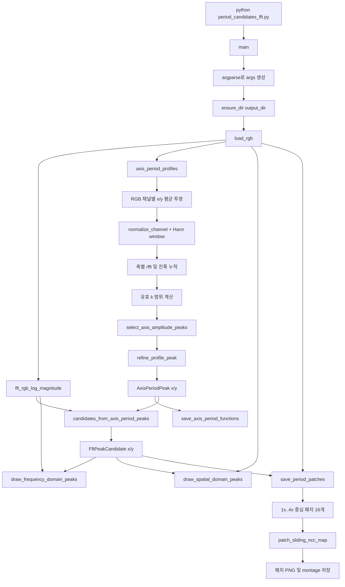

# Pattern Extract Projects

이 저장소는 섬유/패턴 이미지에서 반복 주기 후보를 찾고, 후보 패치와 분석 결과를 저장하는 실험 코드 모음입니다.

현재 편집기에서 확인하는 기본 실행 경로는 `period_candidates_fft.py`입니다. 이 파일은 함수가 위에서 아래로 모두 실행되는 구조가 아니라, 파일 마지막의 `main()`이 진입점이 되어 필요한 함수만 호출합니다.

## 1. 실행 파일과 역할

| 파일 | 실행 시점 | 역할 |
| --- | --- | --- |
| `period_candidates_fft.py` | 주기 후보 분석 | RGB 이미지의 x/y 축 반복 주기를 1D FFT로 추정하고 시각화/패치를 생성 |
| `period_candidates_visualization.py` | 직접 실행하지 않음 | FFT 결과, 공간 주기, 패치 결과를 PNG로 그리는 함수 제공 |
| `build_period_fft_outputs_pdf.py` | FFT 분석 후 선택 실행 | 이미지별 PNG 3장을 케이스별 1페이지 PDF로 결합 |
| `make_ncc_patch_montages.py` | 패치 생성 후 선택 실행 | 16개 패치를 NCC 값으로 재정렬한 montage 생성 |
| `seamless_fabric_pipeline_v4.py` | 별도 파이프라인 | VGG/FFT/TexTile 점수로 최적 패치를 선택하고 타일링 |
| `seamless_fabric_pipeline_v5.py` | 별도 파이프라인 | V4를 확장한 패치 선택 파이프라인 |

## 2. `period_candidates_fft.py` 실제 실행 흐름



### 2.1 진입점과 인자

실행은 `if __name__ == "__main__":`에서 `main()`을 호출하면서 시작합니다.

```bash
python period_candidates_fft.py \
  --image input_pattern/1024ver/example.png \
  --output-dir outputs/period_fft_outputs/example \
  --patch-output-dir outputs/fft_patch/example
```

`main()`이 읽는 주요 CLI 변수는 다음과 같습니다.

| 변수 | 기본값 | 의미 |
| --- | ---: | --- |
| `args.image` | 필수 | 입력 이미지 경로 |
| `args.output_dir` | `outputs/fft_center_peak_example` | 주기 그래프와 FFT/공간 시각화 저장 폴더 |
| `args.patch_output_dir` | `outputs/fft_patch` | 16개 주기 패치 저장 폴더 |
| `args.min_period` | `10.0` | 허용하는 최소 공간 주기(px) |
| `args.max_period` | `250.0` | 허용하는 최대 공간 주기(px) |
| `args.max_peaks` | `20` | 후보 상한. 현재 `main()`은 실제로 최대 2개만 생성 |
| `args.min_peak_percentile` | `80.0` | 현재 축별 경로에서는 사용되지 않음. 레거시 2D 경로 인자 |
| `args.dedupe_period_px` | `4.0` | 현재 축별 경로에서는 사용되지 않음. 레거시 2D 경로 인자 |

### 2.2 입력 로드와 시각화용 2D FFT

1. `ensure_dir(args.output_dir)`가 출력 폴더를 만듭니다.
2. `load_rgb(args.image)`가 이미지를 RGB로 변환합니다.
    - 반환값 `image`: PIL RGB 이미지
    - 반환값 `rgb`: shape `(height, width, 3)`인 `float32` NumPy 배열
3. `fft_rgb_log_magnitude(rgb)`가 시각화용 2D FFT magnitude를 계산합니다.
    - 각 RGB 채널을 `normalize_channel()`로 평균 0, 표준편차 1로 정규화합니다.
    - x/y 방향 Hann window를 곱합니다.
    - `np.fft.fft2()`와 `np.fft.fftshift()`를 적용합니다.
    - 세 채널의 magnitude 제곱을 합친 뒤 `log1p(sqrt(...))`를 반환합니다.

`mag`는 주파수 영역 배경 이미지와 후보 위치 표시에는 사용되지만, 현재 최종 후보를 고르는 기준은 아닙니다.

### 2.3 실제 주기 후보 계산: `axis_period_profiles()`

현재 후보 선택의 핵심 함수입니다.

1. 이미지 크기에서 `h`, `w`를 얻고 FFT bin 배열 `ks = 1..max_axis_k`를 만듭니다.
2. RGB 각 채널에 대해 다음 1D 신호를 만듭니다.
    - `signal_x`: 각 열의 평균값 `channel.mean(axis=0)`
    - `signal_y`: 각 행의 평균값 `channel.mean(axis=1)`
3. 각 신호를 `normalize_channel()`로 정규화하고 해당 축의 Hann window를 곱합니다.
4. `np.fft.rfft()`를 실행합니다. DC 성분 `k=0`은 버리고 x/y 진폭 제곱을 누적합니다.
5. 누적 진폭에 `log1p(sqrt(...))`를 적용한 뒤 `normalize_01()`로 `amp_x`, `amp_y`를 0~1 범위로 만듭니다.
6. 이미지 길이 `N`과 FFT bin `k`의 관계인 `period_px = N / k`를 사용해 허용 주기 범위를 k 범위로 바꿉니다.
    - x축: `ceil(w / max_period)` 이상, `floor(w / min_period)` 이하
    - y축: `ceil(h / max_period)` 이상, `floor(h / min_period)` 이하
7. `select_axis_amplitude_peaks()`가 각 축에서 가장 작은 k부터 국소 피크를 검사합니다.
    - 진폭이 최대 진폭의 `AXIS_PEAK_RELATIVE_THRESHOLD` 이상이어야 합니다.
    - 피크가 없으면 허용 범위 안의 최대 진폭 bin 하나를 fallback으로 사용합니다.
    - `AXIS_DUPLICATE_K_THRESHOLD`보다 가까운 k는 중복으로 제거합니다.
    - 현재 `count=1`이므로 x/y에서 각각 기본 피크 하나만 반환합니다.
8. `refine_profile_peak()`가 선택된 bin의 좌우 세 점에 `subpixel_peak_1d()`를 적용해 k를 소수 첫째 자리까지 보정합니다.
9. `AxisPeriodPeak`에 `axis`, `k`, `period_px`, `amplitude`를 담아 반환합니다.

### 2.4 후보 변환: `candidates_from_axis_period_peaks()`

x축 피크와 y축 피크가 모두 있을 때만 후보를 만듭니다.

- x 후보: `(kx, ky) = (x_peak.k, 0)`
- y 후보: `(kx, ky) = (0, y_peak.k)`

중첩 함수 `add_candidate()`가 주파수 좌표를 픽셀 단위 주기 벡터로 변환합니다.

$$
D = (k_x / w)^2 + (k_y / h)^2
$$

$$
dx = (k_x / w) / D, \qquad dy = (k_y / h) / D
$$

그 결과를 `FftPeakCandidate`에 저장합니다.

| 필드 | 의미 |
| --- | --- |
| `candidate_id` | 후보 번호 |
| `peak_x`, `peak_y` | FFT 이미지 중심에서의 피크 위치 |
| `kx`, `ky` | 주파수 bin 좌표 |
| `dx`, `dy` | 한 주기를 이동하는 공간 벡터(px) |
| `period_px` | `hypot(dx, dy)`로 계산한 주기 길이 |
| `angle_deg` | 공간 벡터 방향 각도 |
| `candidate_score` | 해당 축 FFT 피크 진폭 |

현재 `main()`은 `max_candidates=min(args.max_peaks, 2)`를 전달하므로 정상적인 경우 x/y 축 후보 2개가 생성됩니다.

### 2.5 시각화와 패치 저장

`main()`은 후보 계산 뒤 다음 순서로 결과를 씁니다.

1. `save_axis_period_functions()`
    - x/y 진폭 프로파일과 선택된 `AxisPeriodPeak`를 저장합니다.
    - 파일: `axis_period_functions.png`
2. `draw_frequency_domain_peaks()`
    - `mag`를 8-bit 이미지로 정규화하고 FFT 중심 및 후보 피크를 표시합니다.
    - 파일: `frequency_domain_peaks.png`
3. `draw_spatial_domain_peaks()`
    - 원본 이미지 중심에서 `dx`, `dy` 방향으로 반복되는 점과 화살표를 표시합니다.
    - 파일: `spatial_domain_peaks.png`
4. `save_period_patches()`
    - 첫 x 후보의 `base_dx`, 첫 y 후보의 `base_dy`를 기준으로 합니다.
    - `dx_mult`, `dy_mult`를 각각 1부터 4까지 바꿔 총 16개 중심 패치를 자릅니다.
    - 각 패치를 `patch_sliding_ncc_map()`으로 원본 전체에 대조하고 NCC heatmap을 만듭니다.
    - 파일: `period_patch_dx{dx_mult}_dy{dy_mult}.png`, `period_patch_boxes.png`, `period_patches_16.png`

## 3. 주요 함수 목록

### 현재 실행 경로에서 호출되는 함수

- `main()`: CLI 파싱부터 모든 출력 생성까지 orchestration
- `ensure_dir()`: 폴더 생성
- `load_rgb()`: 입력 이미지 로드 및 배열 변환
- `normalize_channel()`, `normalize_01()`: 신호 정규화
- `fft_rgb_log_magnitude()`: 시각화용 RGB 2D FFT
- `axis_period_profiles()`: 실제 x/y 1D FFT 주기 분석
- `select_axis_amplitude_peaks()`: 축별 피크 선택
- `refine_profile_peak()`, `subpixel_peak_1d()`: 피크 위치 보정
- `candidates_from_axis_period_peaks()`: 축 피크를 최종 후보로 변환
- `save_axis_period_functions()`, `draw_frequency_domain_peaks()`, `draw_spatial_domain_peaks()`: 분석 PNG 생성
- `save_period_patches()`: 주기 배수별 패치 생성
- `center_patch_box()`: 이미지 중심 기준 crop 좌표 계산
- `patch_sliding_ncc_map()`: RGB 채널별 valid NCC map 계산
- `valid_cross_correlation_2d()`, `sliding_window_sum()`: NCC 계산용 FFT convolution 및 적분합
- `suppress_self_overlap()`: 원본 패치와 거의 겹치는 위치 제거
- `ncc_map_to_heatmap()`, `draw_grid_patch_preview()`, `save_patch_box_preview()`, `save_patch_montage()`: 패치 결과 시각화

### 현재 `main()`에서 호출하지 않는 레거시 함수

`refine_peak_parabolic()`, `find_center_peak_candidates()`, `rank_candidates_by_fft()`, `max_filter_2d()`, `crop_center_patch()`, `patch_sliding_grid_error()`, `suppress_self_match()`, `top_local_maxima_positions()`, `distance_to_nearest_grid()`는 예전 2D FFT 후보 탐색 또는 grid error 경로에 남아 있습니다. 현재 후보 결정은 `axis_period_profiles()` 경로만 사용합니다.

## 4. 후처리 실행 흐름

### 4.1 PDF 요약 생성

`build_period_fft_outputs_pdf.py`는 FFT 분석을 실행하지 않습니다. 이미 존재하는 폴더에서 다음 세 PNG가 모두 있는 케이스만 모읍니다.

- `{case}_axis_period_functions.png`
- `{case}_frequency_domain_peaks.png`
- `{case}_spatial_domain_peaks.png`

호출 순서는 `main`의 인자 파싱 → `build_pdf()` → `collect_cases()` → 케이스별 `draw_image_fit()` → PDF 저장입니다.

```bash
python build_period_fft_outputs_pdf.py \
  --output-dir outputs/period_fft_outputs \
  --pdf pdf/period_fft_outputs_summary.pdf
```

### 4.2 NCC 패치 montage 생성

`make_ncc_patch_montages.py`는 이미 생성된 `period_patch_dx...dy...png` 파일을 읽습니다.

실행 순서는 인자 파싱 → 패치 파일 그룹화 → 대응 CSV에서 `read_base_period()` → 각 패치의 `patch_ncc()` 계산 → `draw_ncc_montage()` → montage 저장입니다.

```bash
python make_ncc_patch_montages.py \
  --input-dir input_pattern/1024ver \
  --patch-dir outputs/fft_patch \
  --csv-dir outputs/period_fft_outputs \
  --output-dir tmp/pdfs/ncc_patch_channel_render
```

## 5. 데이터와 출력 관계

```text
입력 이미지
  -> image (PIL RGB), rgb (H x W x 3)
  -> amp_x, amp_y, axis_peaks_x, axis_peaks_y
  -> candidates (x/y FftPeakCandidate)
  -> 분석 PNG 3장
  -> base_dx/base_dy
  -> 1x..4x 조합 패치 16장 + patch montage
  -> 선택적으로 PDF 및 NCC ranking montage
```

## 6. V4/V5 파이프라인과의 차이

`period_candidates_fft.py`는 주기 후보와 시각화/패치 검증을 위한 비교적 독립적인 FFT 도구입니다. `seamless_fabric_pipeline_v4.py`와 `seamless_fabric_pipeline_v5.py`는 별도의 실행 경로로, 후보 패치마다 VGG style, RTV, TexTile, area penalty 등을 계산하여 최종 패치를 선택한 뒤 `repeat_tile()`로 출력 이미지를 만듭니다. V4의 함수별 상세 설명은 [V4_README.md](V4_README.md)에 정리되어 있습니다.