# V4_README

## 1. 파일 목적
[seamless_fabric_pipeline_v4.py](seamless_fabric_pipeline_v4.py)는
반복 가능한 패치(tile)를 자동으로 찾고, 해당 패치를 주기적으로 반복하여 심리스 패턴 결과를 생성하는 파이프라인입니다.

핵심 아이디어는 다음과 같습니다.
1. TexTile로 회전 정렬(옵션)
2. VGG/FFT로 주기 후보 추정
3. TexTile로 크롭 크기 후보 보강
4. style + RTV + TexTile + area penalty 결합 점수로 최적 패치 선택
5. 선택 패치 반복 타일링

---

## 2. 전체 실행 흐름 (main 기준)

1. 입력/옵션 파싱
2. 이미지 로드: load_image
3. (옵션) TexTile 스코어러 구성: TextileTileabilityScorer
4. (옵션) 회전 정렬: find_best_rotation
5. 스타일/타일링 점수기 구성: VGGStyleLayer20, TileabilityLoss
6. 후보 기반 패치 추출: extract_tile_patch
7. 선택 패치 저장 + 후보 패치 저장: save_image, save_candidate_patches
8. 최종 반복 출력 생성: repeat_tile
9. 결과 이미지 저장: save_image

---

## 3. 함수/클래스 역할 정리

### 3.1 IO 및 기본 유틸

- load_image(path, device, max_side=None)
  - PIL 이미지를 RGB로 읽어 [1, 3, H, W] float 텐서([0,1])로 변환합니다.
  - max_side가 주어지면 비율 유지 리사이즈 후 로드합니다.

- save_image(tensor, path)
  - 텐서를 이미지로 저장합니다.
  - 디렉터리가 없으면 자동 생성합니다.

- parse_size(value)
  - "1024x1024" 형식 문자열을 (H, W) 튜플로 변환합니다.

- default_textile_checkpoint()
  - textile.pth 기본 경로 후보를 순서대로 검사해 첫 유효 경로를 반환합니다.

- center_crop_tensor(img, crop_h, crop_w)
  - 중심 크롭을 수행하고, (oy, ox, h, w) 메타 정보를 함께 반환합니다.

- _valid_rotation_crop_hw(img_h, img_w, angle_rad)
  - 회전 후 검은 여백이 없는 유효 중심 크롭 크기를 계산합니다.

- rotate_image(img, angle_degrees, crop_valid=True)
  - affine_grid + grid_sample로 회전합니다.
  - crop_valid=True면 유효 영역 중심 크롭까지 수행합니다.

### 3.2 TexTile 점수기

- class TextileTileabilityScorer
  - TexTile 모델 로딩/전처리/추론을 감싸는 래퍼입니다.

- __init__(...)
  - 체크포인트 로딩, 장치 설정, 정규화 버퍼(mean/std) 준비.

- _load_model(model_path)
  - textile 패키지 로더(CreateModel) 우선 시도.
  - 실패 시 TorchScript(torch.jit.load)로 폴백.

- _unwrap_model_output(result)
  - 모델 출력(dict/tuple/list/tensor)을 logits 텐서로 정규화합니다.

- forward(image, return_logits=True, normalize=True, rescale=True, tile=True)
  - (옵션) 타일 반복/리사이즈/정규화 후 logits 또는 sigmoid 점수 반환.

- logit(image)
  - 평균 로짓 반환.

- tileability(image)
  - 타일 가능성 점수(sigmoid)만 반환.

- logit_and_tileability(image)
  - (평균 로짓, 타일 가능성 점수) 동시 반환.

### 3.3 회전 탐색 및 TexTile 크기 후보 탐색

- find_best_rotation(img, textile_scorer, coarse_step=5.0, refine_step=1.0, crop_valid=True)
  - 전역 coarse 탐색 + 국소 refine 탐색으로 최적 회전 각도를 선택합니다.
  - 반환: 정렬 이미지, 최고 점수/각도/상위 평가 로그.

- _sample_axis_sizes(length, samples)
  - 축 길이에서 샘플 크기 후보를 균등 간격으로 추출합니다.

- detect_textile_pattern_sizes(img, textile_scorer, size_grid=16, top_k=6, refine_top_k=4)
  - 중심 크롭 기준으로 (h,w) 격자 점수를 계산합니다.
  - 상위 후보 주변을 재탐색해 더 정밀한 크기 후보를 얻습니다.

### 3.4 VGG/FFT 주기 추정

- _first_peak(profile, lo, hi)
  - 지정 구간에서 첫 주요 피크 인덱스를 반환합니다.

- estimate_period_fft_power(img, min_period=1, max_period=None)
  - FFT 전력 스펙트럼의 자기상관 피크를 이용해 (py, px) 주기를 추정합니다.

- class VGGActivations
  - VGG19의 고정 레이어(VGG_LAYER=20) 특성 맵을 추출합니다.

- VGGActivations.forward(img)
  - 정규화 후 지정 레이어까지 전파해 특성 텐서를 반환합니다.

- _period_from_feature(feat, stride, ...)
  - 활성 피크 간 거리 히스토그램 투표로 수평/수직 주기를 추정합니다.

- build_patch_candidates(periods, image_hw, textile_size_candidates)
  - VGG/FFT 주기 후보와 TexTile 크기 후보를 병합·중복 제거합니다.

### 3.5 패치 점수 및 선택

- patchwise_tv(img, p=4)
  - x/y 방향 TV를 계산합니다.

- rtv(img, p=4, eps=1e-8)
  - Relative Total Variation 계산. 낮을수록 반복 경계 불연속이 작다고 해석합니다.

- class VGGStyleLayer20
  - VGG feature Gram 기반 스타일 유사도(손실) 계산기입니다.

- VGGStyleLayer20._feat(img)
  - 리사이즈+정규화 후 지정 레이어 feature를 추출합니다.

- VGGStyleLayer20.gram(feat)
  - Gram 행렬 계산.

- VGGStyleLayer20.image_gram(img)
  - 이미지의 Gram 행렬 반환.

- VGGStyleLayer20.loss_to_gram(img, target_gram)
  - target Gram 대비 MSE 손실 반환.

- VGGStyleLayer20.forward(out_img, target_img)
  - 두 이미지 스타일 손실(MSE of Gram) 반환.

- class TileabilityLoss
  - style, RTV, TexTile, area penalty를 가중합해 패치 총점을 계산합니다.

- TileabilityLoss.score_parts(img)
  - 각 손실 항목과 total 점수를 딕셔너리로 반환합니다.

- TileabilityLoss.score(img)
  - total 점수만 반환합니다.

- select_patch_at_size(img, patch_hw, patch_scorer, offset_step=8, search_hw=None)
  - 고정 크기 패치에 대해 오프셋 격자 탐색을 수행해 최저 점수 위치를 선택합니다.

- extract_tile_patch(img, act_fn, patch_scorer, textile_scorer=None, offset_step=8, use_fft=True, textile_size_grid=16, textile_size_top_k=4)
  - 후보 생성(VGG/FFT/TexTile) → 후보별 오프셋 탐색 → 최적 패치 선택까지 수행합니다.
  - 반환: 최적 패치, 패치 좌표, 탐색 상세 정보.

### 3.6 출력/리포팅 유틸

- repeat_tile(tile, out_h, out_w)
  - 패치를 반복해 원하는 출력 해상도로 자르고 반환합니다.

- _safe_name(value)
  - 후보 이름을 파일명 안전 문자열로 변환합니다.

- save_candidate_patches(candidate_results, output_dir)
  - 후보 패치들을 순위별로 파일 저장합니다.

- format_score_parts(parts)
  - 점수 항목을 로그 출력 문자열로 포맷합니다.

### 3.7 엔트리 포인트

- main()
  - 파이프라인 전체를 순차 실행합니다.

---

## 4. 호출 관계 (Call Graph)

```mermaid
flowchart TD
    A[main] --> B[load_image]
    A --> C[TextileTileabilityScorer.__init__]
    C --> C1[_load_model]

    A --> D[find_best_rotation]
    D --> D1[rotate_image]
    D1 --> D1a[_valid_rotation_crop_hw]
    D1 --> D1b[center_crop_tensor]
    D --> D2[textile_scorer.tileability]

    A --> E[VGGStyleLayer20.__init__]
    A --> F[VGGStyleLayer20.image_gram]
    F --> F1[VGGStyleLayer20._feat]
    F --> F2[VGGStyleLayer20.gram]

    A --> G[TileabilityLoss.__init__]
    A --> H[VGGActivations.__init__]
    A --> I[extract_tile_patch]

    I --> I1[VGGActivations.forward]
    I --> I2[_period_from_feature]
    I --> I3[estimate_period_fft_power]
    I3 --> I3a[_first_peak]
    I --> I4[detect_textile_pattern_sizes]
    I4 --> I4a[_sample_axis_sizes]
    I4 --> I4b[center_crop_tensor]
    I4 --> I4c[textile_scorer.tileability]
    I --> I5[build_patch_candidates]
    I --> I6[select_patch_at_size]
    I6 --> I6a[TileabilityLoss.score_parts]
    I6a --> I6a1[rtv]
    I6a1 --> I6a1x[patchwise_tv]
    I6a --> I6a2[textile_scorer.logit_and_tileability]
    I6a --> I6a3[VGGStyleLayer20.loss_to_gram]
    I6a3 --> I6a3x[VGGStyleLayer20.image_gram]

    A --> J[save_image patch]
    A --> K[save_candidate_patches]
    K --> J
    K --> K1[_safe_name]

    A --> L[repeat_tile]
    A --> M[save_image output]
    A --> N[format_score_parts]
```

---

## 5. 데이터 흐름 요약

1. 입력 이미지 img가 준비되면, 필요 시 회전 정렬된 img_aligned로 대체됩니다.
2. img_aligned에서 주기 후보(vgg/fft)와 크기 후보(textile-size)를 구성합니다.
3. 후보마다 패치 위치를 스캔하며 TileabilityLoss를 계산합니다.
4. 최소 total 점수 패치를 patch_best로 선택합니다.
5. patch_best를 파일로 저장하고, repeat_tile로 결과 이미지를 만듭니다.

---

## 6. 주요 설정 파라미터 포인트

- 회전 탐색: --rotation-step, --rotation-refine-step, --no-rotation-search
- 주기 후보: --no-fft
- TexTile: --no-textile, --textile-ckpt, --textile-resolution, --textile-tiles, --textile-lambda
- 크기 후보 탐색: --textile-size-grid, --textile-size-top-k
- 위치 탐색: --offset-step
- 점수 가중치: --style-weight, --rtv-weight, --textile-weight, --area-weight
- 출력 크기: --out-size

---

## 7. 참고

- 이 파이프라인은 패치 자체를 후처리로 블렌딩하지 않습니다.
- 따라서 "좋은 패치 선택" 성능이 최종 결과 품질의 대부분을 결정합니다.
